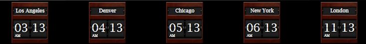

# Components for nsquared dashboard

The components on this page have been built by nsquared and digitally signed so you know you can safely add them to your nsquared dashboard application.

## Clocks

> [Download Clocks](https://nsquaredorders.blob.core.windows.net/downloads/nsquared.clocks.Component)

> Note: the clocks is used in the [World Map Layout](../Layouts/Index.md)