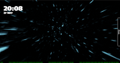
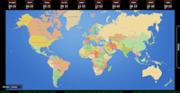

# Layouts for nsquared dashboard

The layouts on this page have been built by nsquared and digitally signed so you know you can safely add them to your nsquared dashboard application.

## Space

> [Download Space](https://nsquaredorders.blob.core.windows.net/downloads/Space.Layout)

## World Map

> [Download World Map](https://nsquaredorders.blob.core.windows.net/downloads/WorldMap.Layout)

> Note: to see the clocks in the world map you will need to install the [Clocks component](../Components/Index)