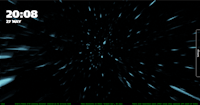
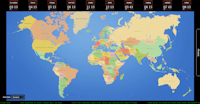
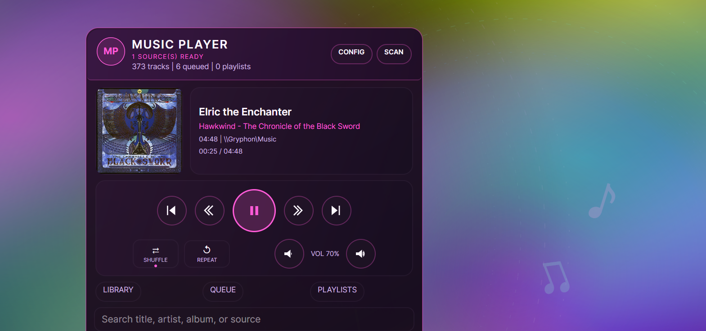

# Layouts for nsquared dashboard

The layouts on this page have been built by nsquared and digitally signed so you know you can safely add them to your nsquared dashboard application.

## Space

> [Download Space](https://nsquaredorders.blob.core.windows.net/downloads/Space.Layout)

## World Map

> [Download World Map](https://nsquaredorders.blob.core.windows.net/downloads/WorldMap.Layout)

> Note: to see the clocks in the world map you will need to install the [Clocks component](../Components/Index)

## Music Scene
> NOTE: Windows only right now

> [Download Music Scene Installer](https://nsquaredorders.blob.core.windows.net/downloads/nsquared.musicplayer.installer.msi)

The Music Scene installer adds the player experience shown in the dashboard screenshots, including the music controls, album art, and volume controls.

[Information on creating your own layouts](./Building%20a%20Layout)

[Information on hosting a component in a layout](./Hosting%20a%20Component%20in%20a%20Layout)
