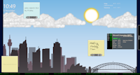
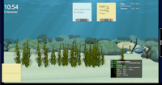
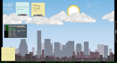
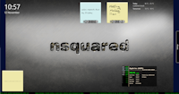

# nsquared dashboard

## Introduction

nsquared dashboard turns your large screens into interactive information boards.

The nsquared dashboard application comes with a selection of predefined layouts.

The free version allows you to select from basic layouts and components.

To control the dashboard from the web portal you will need to register the product.

> [Download from the nsquared dashboard product page](https://nsquared.com.au/products/dashboard)

---

## Adding new layouts

Layout files can be added. You can download layouts (.layout) files and add them from the Settings panel.

> [Layouts available to download](./Docs/Layouts/Index.md)

> [Information on creating your own layouts](./Docs/Layouts/Building%20a%20Layout)

---

## Adding new components

Additional components can be installed on the licensed version of nsquared dashboard.

> [Components available to download](./Docs/Components/Index.md)

⭐⭐⭐ Coming Soon ⭐⭐⭐
> Information on creating your own components
